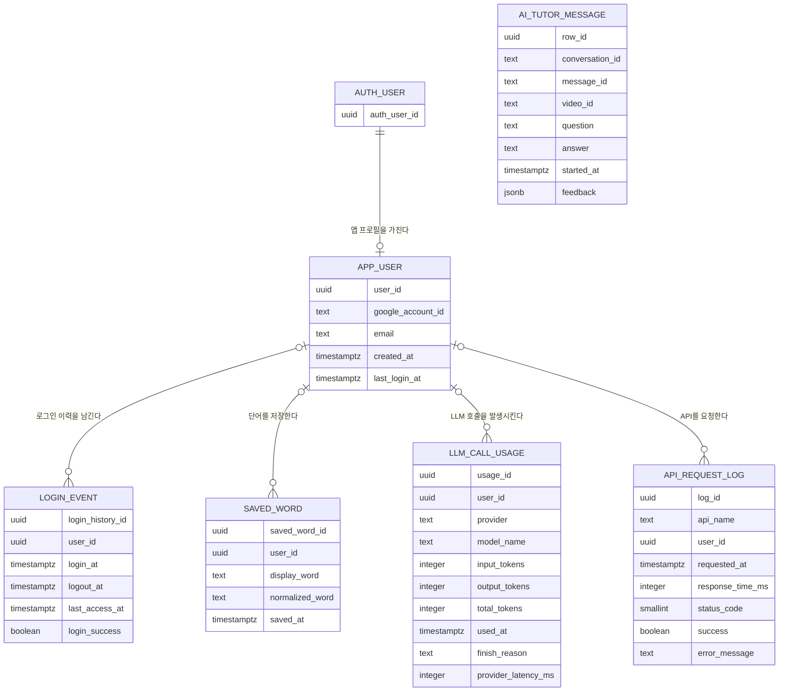
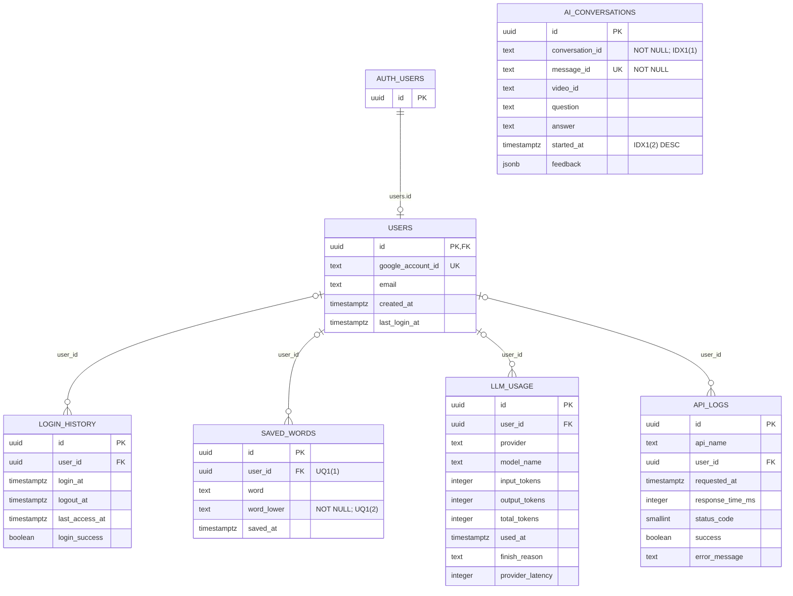

# SubSync 데이터베이스 설계서

## 1. 문서 개요

| 항목 | 내용 |
| --- | --- |
| 기준일 | 2026-09-09 |
| DBMS | Supabase PostgreSQL |
| 애플리케이션 스키마 | `public` |
| 인증 스키마 | Supabase가 관리하는 `auth` |
| 설계 대상 | `users`, `login_history`, `saved_words`, `ai_conversations`, `llm_usage`, `api_logs` |
| 문서 상태 | 프로젝트의 1~6번 SQL을 기준으로 작성한 목표 스키마 설계서 |

이 문서는 다음 여섯 개 SQL 파일을 기준으로 정규화, 논리·물리 ERD, 컬럼 정의,
제약조건과 인덱스를 정리한다.

1. 1. users.sql
2. 2. login_history.sql
3. 3. saved_words.sql
4. 4. ai_conversations.sql
5. 5. llm_usage.sql
6. 6. api_logs.sql

`db_schema.sql`은 위 파일을 한 번에 확인하기 위한 통합 스키마 스냅샷이다. 새
환경에서는 번호 SQL과 통합 스키마를 중복 실행하지 않는다.

## 2. 설계 목표

- Supabase Auth 사용자와 애플리케이션 사용자를 중복 없이 연결한다.
- 로그인 이력, 저장 단어, LLM 사용량과 API 로그를 서로 다른 책임의 테이블로 분리한다.
- 로그인 구현 상태와 관계없이 AI Tutor 질문·답변을 저장할 수 있게 한다.
- PK, FK와 UNIQUE 제약조건으로 참조 무결성과 중복 방지를 보장한다.
- 질문·답변 원문과 운영 로그를 분리해 개인정보 노출 범위를 줄인다.
- 논리 모델은 3NF를 기준으로 하고, 물리 모델의 파생·중복 컬럼은 목적과 동기화 규칙을
  명시한다.

## 3. 점검 기준 충족 요약

| 점검 기준 | 판정 | 문서 근거 |
| --- | --- | --- |
| 3NF 및 이상현상 방지 | 충족(논리 모델), 통제 필요(물리 파생값) | 5절에서 함수 종속성과 정규형을 테이블별로 검토하고, `last_login_at`, `word_lower`, `success`의 중복 목적과 갱신 규칙을 명시했다. |
| 논리 ERD와 물리 ERD 작성·일치 | 충족 | 6절의 논리 ERD, 7절의 물리 ERD, 7.2절의 엔티티-테이블 매핑과 7.3절의 관계·카디널리티 표로 교차 검증한다. |
| 컬럼 타입·길이·제약·기본값·코멘트 | 충족(설계 문서 기준) | 8절 데이터 사전에 여섯 테이블의 모든 컬럼을 빠짐없이 정의했다. 현재 DDL에 없는 길이 제한과 기본값도 각각 `상한 미지정`, `없음`으로 명시했다. |

> **판정 해석:** 현재 SQL은 핵심 PK·FK·UNIQUE를 구현했지만, 일부 파생값의 일관성을
> 강제하는 트리거나 `CHECK`와 DB 메타데이터용 `COMMENT ON`은 아직 없다. 따라서
> 문서상 규칙과 실제 DB 강제 조건을 완전히 일치시키려면 13절의 보완 migration이
> 필요하다.

## 4. 전체 테이블 구성

| 순서 | 논리 엔티티 | 물리 테이블 | 행의 단위(Grain) | 사용자 연결 |
| --- | --- | --- | --- | --- |
| 1 | 앱 사용자 | `public.users` | Supabase Auth 사용자 1명당 최대 1행 | `auth.users(id)`와 공유 PK |
| 2 | 로그인 이력 | `public.login_history` | 로그인 시도 또는 세션 1건당 1행 | `public.users(id)`, 선택 값 |
| 3 | 저장 단어 | `public.saved_words` | 사용자가 저장한 정규화 단어 1개당 1행 | `public.users(id)`, 선택 값 |
| 4 | AI Tutor 메시지 | `public.ai_conversations` | 사용자 질문과 Tutor 답변 한 쌍당 1행 | 연결 없음 |
| 5 | LLM 호출 사용량 | `public.llm_usage` | Provider 호출 1건당 1행 | `public.users(id)`, 선택 값 |
| 6 | API 요청 로그 | `public.api_logs` | API 요청 1건당 1행 | `public.users(id)`, 선택 값 |

`ai_conversations`라는 테이블명과 달리 실제 행의 단위는 대화방이 아니라 질문·답변
메시지 한 쌍이다. 같은 `conversation_id`를 가진 여러 행이 하나의 연속 대화를 이룬다.

## 5. 정규화 및 이상현상 방지 설계

### 5.1 정규화 원칙

- **제1정규형(1NF):** 한 셀에는 한 값만 저장한다. `feedback`은 현재 한 메시지에
  최대 하나인 피드백 문서 전체를 `JSONB` 단일 값으로 취급한다. 피드백 구성 요소를
  개별 검색·집계하거나 여러 평가를 허용하면 별도 테이블로 분리해야 한다.
- **제2정규형(2NF):** 모든 테이블의 기본키가 단일 컬럼 `id`이므로 복합 기본키의
  일부에만 의존하는 부분 함수 종속이 없다.
- **제3정규형(3NF):** 일반 속성은 원칙적으로 해당 행의 식별자에만 의존한다. 조회
  성능이나 중복 판정을 위해 둔 파생값은 5.3절의 통제된 비정규화로 구분한다.

### 5.2 테이블별 함수 종속성과 3NF 판정

| 테이블 | 주요 함수 종속성 | 3NF 판정 | 근거 및 유의사항 |
| --- | --- | --- | --- |
| `users` | `id → google_account_id, email, created_at, last_login_at` | 기본 충족 / 예외 1건 | 사용자 속성은 `id`에 종속된다. `last_login_at`은 로그인 이력에서 계산 가능한 캐시 값이므로 통제가 필요하다. |
| `login_history` | `id → user_id, login_at, logout_at, last_access_at, login_success` | 충족 | 로그인 이벤트의 속성이 해당 이력 ID에만 종속된다. |
| `saved_words` | `id → user_id, word, word_lower, saved_at` | 기본 충족 / 예외 1건 | `word_lower`는 표시용 `word`에서 생성하는 중복 판정용 파생값이다. |
| `ai_conversations` | `id → conversation_id, message_id, video_id, question, answer, started_at, feedback`; `message_id → 동일 속성` | 충족(현재 의미 기준) | `message_id`는 대체키다. `video_id`는 대화방 속성이 아니라 각 메시지 생성 시점의 영상 문맥 스냅샷으로 정의한다. |
| `llm_usage` | `id → user_id, provider, model_name, input_tokens, output_tokens, total_tokens, used_at, finish_reason, provider_latency` | 충족(정의 조건부) | `total_tokens`는 Provider가 보고한 청구·정규화 총량으로 정의하며 반드시 입력+출력 합과 같다고 가정하지 않는다. 항상 합계라면 파생 컬럼으로 통제해야 한다. |
| `api_logs` | `id → api_name, user_id, requested_at, response_time_ms, status_code, success, error_message` | 기본 충족 / 예외 1건 | `success`가 `status_code`로부터 계산되므로 두 값의 동기화가 필요하다. |

### 5.3 통제된 비정규화와 일관성 규칙

물리 모델은 조회 성능과 구현 편의를 위해 다음 파생값을 보유한다. 아래 규칙을
지키면 갱신 이상을 방지할 수 있다.

| 파생 컬럼 | 원천 데이터 | 보유 목적 | 필수 일관성 규칙 | 현재 DB 강제 여부 |
| --- | --- | --- | --- | --- |
| `users.last_login_at` | 해당 사용자의 성공한 `login_history.login_at` 최댓값 | 사용자 목록에서 최근 로그인 시각을 빠르게 조회 | 성공 이력 INSERT와 사용자 UPDATE를 하나의 트랜잭션 또는 DB 트리거로 처리 | 미구현 |
| `saved_words.word_lower` | `word`를 trim·소문자화한 값 | 대소문자 차이로 생기는 중복 저장 방지 | INSERT·UPDATE 때 동일한 정규화 함수를 사용하고 `(user_id, word_lower)` UNIQUE 유지 | UNIQUE만 구현 |
| `api_logs.success` | 서비스가 정한 `status_code` 성공 범위 | 성공률 집계 단순화 | 한 곳에서 상태 코드와 성공 여부를 함께 생성하거나 `CHECK`/generated column 사용 | 미구현 |

`ai_conversations.video_id`는 메시지별 스냅샷이므로 현재 정의에서는 파생값이 아니다.
향후 “한 대화는 반드시 하나의 영상에만 속한다”는 규칙을 도입하면
`ai_conversation_sessions(conversation_id, video_id, created_at)`를 분리하고 메시지
테이블에서는 `video_id`를 제거하는 것이 엄격한 3NF에 맞다.

### 5.4 삽입·갱신·삭제 이상 방지

| 이상현상 | 현재 방지 장치 | 남은 위험과 보완책 |
| --- | --- | --- |
| 삽입 이상 | 각 테이블의 독립 UUID PK로 엔티티별 입력이 가능하고, FK가 존재하지 않는 사용자를 참조하는 입력을 거부한다. AI Tutor 메시지는 인증과 분리해 익명 입력도 가능하다. | 사용자 소유 테이블의 `user_id`가 nullable이다. 익명 행을 허용하지 않을 테이블은 `NOT NULL` migration이 필요하다. |
| 중복 삽입 | PK, `users.google_account_id` UNIQUE, `(user_id, word_lower)` UNIQUE, `ai_conversations.message_id` UNIQUE가 중복을 차단한다. | PostgreSQL UNIQUE는 일반적으로 여러 `NULL`을 허용한다. 사용자 단어의 `user_id`는 애플리케이션에서 필수로 검증하거나 DB에서 `NOT NULL`로 변경해야 한다. |
| 갱신 이상 | 책임별 테이블 분리로 사용자·로그인·단어·대화·사용량·API 로그의 독립 갱신이 가능하다. | 5.3절의 파생 컬럼은 트랜잭션, 트리거 또는 `CHECK` 없이 따로 갱신하면 불일치할 수 있다. |
| 삭제 이상 | FK의 기본 `ON DELETE NO ACTION`이 참조 중인 사용자의 우발적 삭제를 막는다. | 사용자 탈퇴 시 이력 보존·익명화·연쇄 삭제 중 어떤 정책을 쓸지 정한 뒤 명시적인 `ON DELETE` 정책이 필요하다. |

## 6. 논리 데이터 모델

### 6.1 논리 엔티티와 속성

| 논리 엔티티 | 주 식별자 | 주요 속성 | 역할 |
| --- | --- | --- | --- |
| 인증 사용자 | 인증 사용자 ID | 인증 정보 | Supabase가 관리하는 외부 엔티티 |
| 앱 사용자 | 사용자 ID | Google 계정 ID, 이메일, 생성 시각, 최근 로그인 시각 | 서비스 사용자 프로필 |
| 로그인 이력 | 로그인 이력 ID | 사용자 ID, 로그인·로그아웃·최근 접근 시각, 성공 여부 | 인증 이벤트 기록 |
| 저장 단어 | 저장 단어 ID | 사용자 ID, 표시 단어, 정규화 단어, 저장 시각 | 사용자 단어장 항목 |
| AI Tutor 메시지 | 행 ID | 대화 ID, 메시지 ID, 영상 ID, 질문, 답변, 생성 시각, 피드백 | 익명 Tutor 대화 한 턴 |
| LLM 호출 사용량 | 사용량 ID | 사용자 ID, Provider, 모델, 토큰, 호출 시각, 종료 사유, 지연 시간 | AI 호출 관측 정보 |
| API 요청 로그 | 로그 ID | API 이름, 사용자 ID, 요청 시각, 응답 시간, 상태, 오류 분류 | API 운영 관측 정보 |

### 6.2 논리 ERD

`AI_TUTOR_MESSAGE`는 인증 미완성 단계에서도 대화를 저장하기 위해 사용자 엔티티와
관계를 맺지 않는다. `conversation_id`가 같은 메시지들은 하나의 대화 그룹을 이루지만,
현재 별도 대화방 엔티티나 FK는 없다.

## 7. 물리 데이터 모델

### 7.1 물리 ERD

물리 ERD에서 `AI_CONVERSATIONS`는 다른 테이블과 연결되지 않는다. `word_lower`,
`conversation_id`의 NOT NULL 여부도 표시했다. `UQ1`은
`saved_words(user_id, word_lower)` UNIQUE INDEX, `IDX1`은
`ai_conversations(conversation_id, started_at DESC)` 조회 인덱스를 뜻한다.
인덱스의 실제 이름과 목적은 7.4절에 기재한다.

### 7.2 논리 엔티티와 물리 테이블 매핑

| 논리 엔티티 | 물리 객체 | 매핑 결과 |
| --- | --- | --- |
| 인증 사용자 | `auth.users` | 외부 관리 엔티티. `id`만 참조한다. |
| 앱 사용자 | `public.users` | 1:1 |
| 로그인 이력 | `public.login_history` | 1:1 |
| 저장 단어 | `public.saved_words` | 1:1; `display_word → word`, `normalized_word → word_lower` |
| AI Tutor 메시지 | `public.ai_conversations` | 1:1; 한 행이 질문·답변 한 쌍이다. |
| LLM 호출 사용량 | `public.llm_usage` | 1:1; `provider_latency_ms → provider_latency` |
| API 요청 로그 | `public.api_logs` | 1:1 |

논리 ERD의 모든 애플리케이션 엔티티는 하나의 물리 테이블에 대응하고, 물리 테이블의
모든 컬럼은 논리 속성 또는 5.3절에서 설명한 파생 속성에 대응한다.

### 7.3 관계와 카디널리티 일치 검증

| 부모 → 자식 | 논리 카디널리티 | 물리 구현 | 일치 여부 |
| --- | --- | --- | --- |
| `auth.users` → `public.users` | 인증 사용자 1명당 앱 사용자 0..1명; 앱 사용자는 인증 사용자 1명에 속함 | 공유 PK/FK `users.id` | 일치 |
| `users` → `login_history` | 사용자 1명당 0..N건; 이력은 사용자 0..1명과 연결 | nullable FK `login_history.user_id` | 일치 |
| `users` → `saved_words` | 사용자 1명당 0..N개; 단어는 사용자 0..1명과 연결 | nullable FK `saved_words.user_id` | 일치 |
| `users` → `llm_usage` | 사용자 1명당 0..N건; 호출은 사용자 0..1명과 연결 | nullable FK `llm_usage.user_id` | 일치 |
| `users` → `api_logs` | 사용자 1명당 0..N건; 로그는 사용자 0..1명과 연결 | nullable FK `api_logs.user_id` | 일치 |
| 사용자 ↔ `ai_conversations` | 관계 없음 | 사용자 FK 없음 | 일치 |

자식 테이블의 `user_id`가 nullable이므로 “자식은 반드시 사용자 한 명에 속한다”가
아니라 0..1로 표현했다. 향후 `NOT NULL`로 변경하면 논리 ERD의 자식 측 최소
카디널리티도 1로 함께 변경해야 한다.

### 7.4 키, 제약조건과 인덱스

| 물리 객체 | 유형 | 컬럼 | 목적 |
| --- | --- | --- | --- |
| 각 테이블의 `*_pkey` | PK/UNIQUE B-tree | `id` | 행 식별 및 UUID 중복 방지 |
| `users_id_fkey` | FK | `users.id → auth.users.id` | 인증 사용자 참조 무결성 |
| 각 사용자 하위 테이블 FK | FK | `user_id → users.id` | 존재하지 않는 사용자 참조 방지 |
| `users_google_account_id_key` | UNIQUE | `google_account_id` | Google 계정 ID 중복 방지 |
| `saved_words_user_word_lower_key` | UNIQUE INDEX | `(user_id, word_lower)` | 사용자별 정규화 단어 중복 방지 |
| `ai_conversations_message_id_key` | UNIQUE INDEX | `message_id` | 동일 Tutor 메시지 중복 저장 방지 |
| `ai_conversations_conversation_started_at_idx` | B-tree INDEX | `(conversation_id, started_at DESC)` | 대화별 메시지 최신순 조회 |

FK에는 `ON UPDATE`와 `ON DELETE`가 명시되지 않아 PostgreSQL 기본값인 `NO ACTION`이
적용된다. PostgreSQL은 FK 컬럼의 인덱스를 자동 생성하지 않으므로 사용자별 조회량이
커지면 각 `user_id` 인덱스를 별도 검토한다.

## 8. 컬럼 데이터 사전

### 8.1 표기 기준

- **길이·범위:** PostgreSQL 저장 크기 또는 값 범위를 기록한다. `TEXT`와 `JSONB`는
  DDL에 문자 수 상한이 없으므로 `가변, 상한 미지정`으로 표시한다.
- **NULL:** `NOT NULL`, PK 등 현재 SQL이 실제로 강제하는 값을 기준으로 한다.
- **기본값:** 여섯 SQL에는 `DEFAULT` 절이 하나도 없다. 따라서 모든 행에 `없음`으로
  표시하며, ID와 시각은 현재 애플리케이션이 전달해야 한다.
- **코멘트:** 아래 설명은 설계서의 컬럼 코멘트다. 현재 SQL에는 PostgreSQL 메타데이터
  코멘트를 생성하는 `COMMENT ON COLUMN` 문이 없다.

### 8.2 `public.users`

Supabase의 `auth.users`와 애플리케이션 사용자를 연결한다. 비밀번호는 저장하지 않고,
같은 UUID를 기본키이자 외래키로 사용한다.

| 컬럼 | 데이터 타입 | 길이·범위 | NULL | 기본값 | 키·제약조건 | 코멘트 |
| --- | --- | --- | --- | --- | --- | --- |
| `id` | `UUID` | 16바이트 | 불가 | 없음 | PK, FK → `auth.users(id)`, `ON DELETE NO ACTION` | Supabase Access Token의 검증된 `sub`와 같은 사용자 식별자 |
| `google_account_id` | `TEXT` | 가변, 상한 미지정 | 가능 | 없음 | UNIQUE | Google 계정의 외부 식별자; `NULL`은 여러 행에 허용될 수 있음 |
| `email` | `TEXT` | 가변, 상한 미지정 | 가능 | 없음 | 없음 | 사용자 이메일 주소; 비밀번호 저장 용도로 사용하지 않음 |
| `created_at` | `TIMESTAMPTZ` | 8바이트, 마이크로초 정밀도 | 가능 | 없음 | 없음 | 앱 사용자 레코드 생성 시각과 시간대 정보 |
| `last_login_at` | `TIMESTAMPTZ` | 8바이트, 마이크로초 정밀도 | 가능 | 없음 | 없음 | 가장 최근 성공 로그인 시각의 조회용 캐시 값 |

### 8.3 `public.login_history`

로그인 시도와 세션 상태를 기록한다. 한 사용자가 여러 로그인 이력을 가질 수 있다.

| 컬럼 | 데이터 타입 | 길이·범위 | NULL | 기본값 | 키·제약조건 | 코멘트 |
| --- | --- | --- | --- | --- | --- | --- |
| `id` | `UUID` | 16바이트 | 불가 | 없음 | PK | 로그인 이력 한 건을 식별하는 ID |
| `user_id` | `UUID` | 16바이트 | 가능 | 없음 | FK → `public.users(id)`, `ON DELETE NO ACTION` | 로그인 주체인 앱 사용자 ID; 현재 DDL은 익명 이력을 허용함 |
| `login_at` | `TIMESTAMPTZ` | 8바이트, 마이크로초 정밀도 | 가능 | 없음 | 없음 | 로그인 시도 또는 성공 시각 |
| `logout_at` | `TIMESTAMPTZ` | 8바이트, 마이크로초 정밀도 | 가능 | 없음 | 없음 | 로그아웃 시각; 열린 세션이면 `NULL` |
| `last_access_at` | `TIMESTAMPTZ` | 8바이트, 마이크로초 정밀도 | 가능 | 없음 | 없음 | 해당 세션의 마지막 접근 시각 |
| `login_success` | `BOOLEAN` | 1바이트, `TRUE`/`FALSE` | 가능 | 없음 | 없음 | 로그인 성공 여부; 미판정 상태는 `NULL` 가능 |

### 8.4 `public.saved_words`

사용자가 저장한 영어 단어를 관리한다. 표시용 원문과 중복 판정용 정규화 값을
분리한다.

| 컬럼 | 데이터 타입 | 길이·범위 | NULL | 기본값 | 키·제약조건 | 코멘트 |
| --- | --- | --- | --- | --- | --- | --- |
| `id` | `UUID` | 16바이트 | 불가 | 없음 | PK | 저장 단어 한 건을 식별하는 ID |
| `user_id` | `UUID` | 16바이트 | 가능 | 없음 | FK → `public.users(id)`, 복합 UNIQUE INDEX 구성, `ON DELETE NO ACTION` | 단어를 저장한 앱 사용자 ID |
| `word` | `TEXT` | 가변, 상한 미지정 | 가능 | 없음 | 없음 | 화면에 표시할 단어 원문 |
| `word_lower` | `TEXT` | 가변, 상한 미지정 | 불가 | 없음 | `(user_id, word_lower)` UNIQUE INDEX | 공백과 대소문자를 정규화한 중복 판정·검색 값 |
| `saved_at` | `TIMESTAMPTZ` | 8바이트, 마이크로초 정밀도 | 가능 | 없음 | 없음 | 단어를 저장한 시각 |

`saved_words_user_word_lower_key`는 `(user_id, word_lower)` 중복을 방지한다. 단,
`user_id`가 `NULL`인 행끼리는 PostgreSQL 일반 UNIQUE 의미상 중복으로 판단되지 않을
수 있으므로 사용자 단어 저장 API는 유효한 사용자 ID를 필수로 검증해야 한다.

### 8.5 `public.ai_conversations`

로그인 여부와 관계없이 AI Tutor 질문과 답변을 메시지 단위로 저장한다. 사용자 ID,
이메일, Access Token과 Provider 정보는 저장하지 않는다.

| 컬럼 | 데이터 타입 | 길이·범위 | NULL | 기본값 | 키·제약조건 | 코멘트 |
| --- | --- | --- | --- | --- | --- | --- |
| `id` | `UUID` | 16바이트 | 불가 | 없음 | PK | 데이터베이스 행 식별자 |
| `conversation_id` | `TEXT` | 가변, 상한 미지정 | 불가 | 없음 | 복합 INDEX 선두 컬럼 | 같은 연속 대화에 속한 메시지를 묶는 식별자 |
| `message_id` | `TEXT` | 가변, 상한 미지정 | 불가 | 없음 | UNIQUE INDEX | Tutor 답변 메시지의 전역 중복 방지 식별자 |
| `video_id` | `TEXT` | 가변, 상한 미지정 | 가능 | 없음 | 없음 | 해당 메시지를 생성할 때 참조한 YouTube 영상 ID |
| `question` | `TEXT` | 가변, 상한 미지정 | 가능 | 없음 | 없음 | 사용자가 입력한 질문 원문 |
| `answer` | `TEXT` | 가변, 상한 미지정 | 가능 | 없음 | 없음 | AI Tutor가 생성한 답변 원문 |
| `started_at` | `TIMESTAMPTZ` | 8바이트, 마이크로초 정밀도 | 가능 | 없음 | `(conversation_id, started_at DESC)` INDEX | 질문·답변 메시지 생성 시각 |
| `feedback` | `JSONB` | 가변, 상한 미지정 | 가능 | 없음 | 없음 | 해당 답변에 대한 0..1개의 유용성·사유·의견·평가 시각 문서 |

`ai_conversations_message_id_key`는 같은 메시지의 재저장을 막고,
`ai_conversations_conversation_started_at_idx`는 대화별 메시지를 최근 시각순으로
조회한다. 테이블에는 RLS가 활성화되어 있으며 anon 정책은 만들지 않는다. 서버의
service role을 사용하는 repository만 접근한다.

### 8.6 `public.llm_usage`

AI Provider 호출별 토큰 사용량, 종료 사유와 응답 시간을 저장한다. 질문과 답변
원문은 포함하지 않는다.

| 컬럼 | 데이터 타입 | 길이·범위 | NULL | 기본값 | 키·제약조건 | 코멘트 |
| --- | --- | --- | --- | --- | --- | --- |
| `id` | `UUID` | 16바이트 | 불가 | 없음 | PK | LLM 호출 사용량 한 건을 식별하는 ID |
| `user_id` | `UUID` | 16바이트 | 가능 | 없음 | FK → `public.users(id)`, `ON DELETE NO ACTION` | 호출 사용자 ID; 인증되지 않은 호출은 `NULL` |
| `provider` | `TEXT` | 가변, 상한 미지정 | 가능 | 없음 | 없음 | `gemini`, `groq`, `stub` 등 호출 경로를 구분하는 Provider 이름 |
| `model_name` | `TEXT` | 가변, 상한 미지정 | 가능 | 없음 | 없음 | Provider에서 호출한 모델 이름 또는 Stub 식별자 |
| `input_tokens` | `INTEGER` | 4바이트, -2,147,483,648~2,147,483,647 | 가능 | 없음 | 없음 | Provider가 보고하거나 서버가 계산한 입력 토큰 수 |
| `output_tokens` | `INTEGER` | 4바이트, -2,147,483,648~2,147,483,647 | 가능 | 없음 | 없음 | Provider가 보고하거나 서버가 계산한 출력 토큰 수 |
| `total_tokens` | `INTEGER` | 4바이트, -2,147,483,648~2,147,483,647 | 가능 | 없음 | 없음 | Provider 기준 청구·정규화 전체 토큰 수 |
| `used_at` | `TIMESTAMPTZ` | 8바이트, 마이크로초 정밀도 | 가능 | 없음 | 없음 | LLM Provider 호출 시각 |
| `finish_reason` | `TEXT` | 가변, 상한 미지정 | 가능 | 없음 | 없음 | 정상 종료, 길이 제한, 안전 정책 등 Provider 종료 사유 |
| `provider_latency` | `INTEGER` | 4바이트, -2,147,483,648~2,147,483,647 | 가능 | 없음 | 없음 | Provider 요청부터 응답까지 걸린 시간(ms) |

토큰 수와 지연 시간은 의미상 0 이상이지만 현재 DDL에는 음수를 막는 `CHECK`가 없다.

### 8.7 `public.api_logs`

API 요청 성공 여부와 성능을 분석하는 운영 로그다. 요청·응답 본문과 인증 토큰은
저장하지 않는다.

| 컬럼 | 데이터 타입 | 길이·범위 | NULL | 기본값 | 키·제약조건 | 코멘트 |
| --- | --- | --- | --- | --- | --- | --- |
| `id` | `UUID` | 16바이트 | 불가 | 없음 | PK | API 요청 로그 한 건을 식별하는 ID |
| `api_name` | `TEXT` | 가변, 상한 미지정 | 가능 | 없음 | 없음 | HTTP 메서드와 정규화한 API 경로 이름 |
| `user_id` | `UUID` | 16바이트 | 가능 | 없음 | FK → `public.users(id)`, `ON DELETE NO ACTION` | 인증 사용자 ID; 익명 요청은 `NULL` |
| `requested_at` | `TIMESTAMPTZ` | 8바이트, 마이크로초 정밀도 | 가능 | 없음 | 없음 | 서버가 API 요청을 수신한 시각 |
| `response_time_ms` | `INTEGER` | 4바이트, -2,147,483,648~2,147,483,647 | 가능 | 없음 | 없음 | API 전체 처리 시간(ms) |
| `status_code` | `SMALLINT` | 2바이트, -32,768~32,767 | 가능 | 없음 | 없음 | 클라이언트에 반환한 HTTP 상태 코드 |
| `success` | `BOOLEAN` | 1바이트, `TRUE`/`FALSE` | 가능 | 없음 | 없음 | 서비스 성공 판정 규칙에 따른 요청 성공 여부 |
| `error_message` | `TEXT` | 가변, 상한 미지정 | 가능 | 없음 | 없음 | 원문·개인정보를 제외한 제한된 오류 분류 또는 요약 |

## 9. 주요 데이터 흐름

| 기능 | 기록 테이블 | 처리 내용 |
| --- | --- | --- |
| 로그인 확인 | `users`, `login_history` | 검증된 JWT `sub`로 사용자 동기화 및 로그인 이력 생성 |
| 로그아웃 | `login_history` | 열린 이력의 `logout_at` 갱신 |
| 단어 저장·조회·삭제 | `saved_words` | 사용자 ID와 정규화 단어를 기준으로 소유권·중복 확인 |
| Tutor 질문 | `ai_conversations` | 사용자 정보 없이 질문과 답변을 메시지 단위로 저장 |
| Tutor 평가 | `ai_conversations` | `message_id`로 대상 행을 찾아 `feedback` JSONB 갱신 |
| AI 호출 측정 | `llm_usage` | Provider·모델·토큰·지연 시간 저장 |
| API 관측 | `api_logs` | 경로·상태 코드·처리 시간과 제한된 오류 분류 저장 |

## 10. 무결성 및 보안 설계

- 모든 애플리케이션 테이블은 UUID `id` PK로 행 무결성을 유지한다.
- FK는 존재하지 않는 사용자의 하위 데이터를 막고, 기본 `NO ACTION`으로 참조 중인
  사용자의 우발적 삭제를 방지한다.
- 사용자 비밀번호는 앱 테이블에 저장하지 않고 Supabase Auth가 관리한다.
- 보호 API는 요청 body의 `user_id`가 아니라 검증된 JWT의 `sub`를 사용해야 한다.
- `service_role` 또는 secret 키는 브라우저, 응답, 로그와 Postman 공유 파일에 넣지 않는다.
- `ai_conversations`에는 사용자 식별자를 넣지 않지만 질문·답변 원문 자체는 민감할 수
  있으므로 접근 권한, 보존 기간과 삭제 정책을 별도로 관리한다.
- `api_logs`에는 자막, 질문, AI 응답 원문과 Access Token을 저장하지 않는다.
- 여섯 DDL 중 RLS 활성화가 명시된 테이블은 `ai_conversations`뿐이다. 사용자 소유
  테이블의 RLS 정책은 인증 기능과 함께 보완해야 한다.

