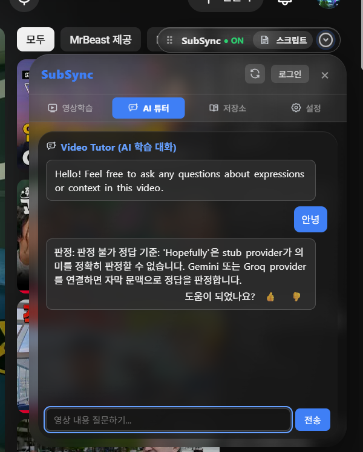
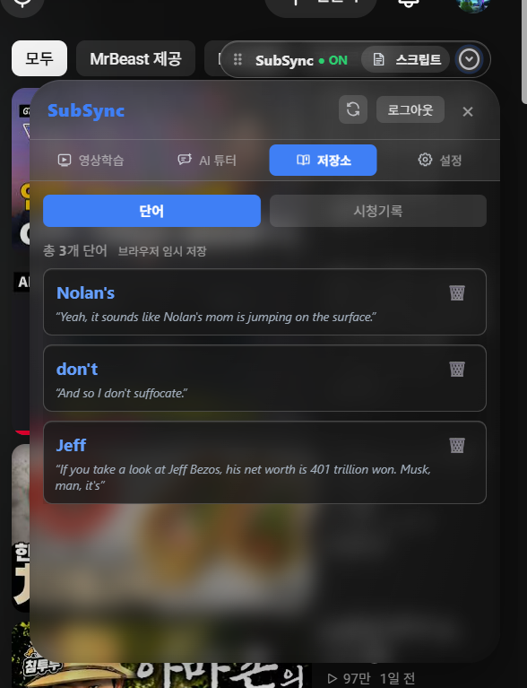
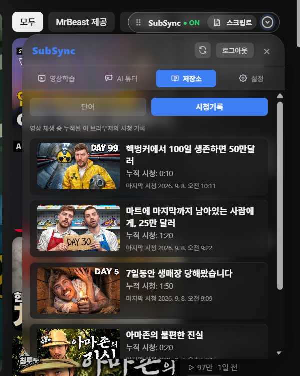

# SubSync 사용자 가이드

SubSync는 YouTube를 시청하면서 영어·한국어 자막을 함께 보고, 자막 속 단어를 학습하고, 전체 Script를 탐색하고, 영상 문맥을 AI Tutor에게 질문할 수 있도록 돕는 Chrome 확장 프로그램입니다.

## 빠른 시작

1. [설치 가이드](INSTALLATION_GUIDE_KO.md)에 따라 SubSync를 설치합니다.
2. 자막이 있는 YouTube 영상을 엽니다.
3. 영상 위에 `SubSync · ON` 퀵바가 표시되는지 확인합니다.
4. **영상학습** 화면에서 영어·한국어 자막을 확인합니다.
5. 모르는 단어에 마우스를 올려 빠른 뜻을 확인합니다.
6. 단어를 클릭하여 상세 설명을 열고 **저장하기**를 선택합니다.
7. 퀵바의 **스크립트**로 전체 자막을 검색하거나 원하는 시점으로 이동합니다.
8. **AI 튜터**에서 영상 표현이나 내용에 대해 질문합니다.
9. **저장소**에서 저장한 단어와 시청기록을 확인합니다.

> 화면과 메뉴 이름은 배포 버전에 따라 일부 변경될 수 있습니다. 아래 기능 설명은 현재 SubSync 화면과 동작을 기준으로 작성되었습니다.

## 1. 화면 구성

### 퀵바

YouTube 영상 위에 표시되는 퀵바에는 다음 컨트롤이 있습니다.

| 컨트롤 | 기능 |
| --- | --- |
| `SubSync · ON/OFF` | SubSync의 주요 학습 표시를 켜거나 끕니다. |
| `스크립트` | 전체 Script 패널을 열거나 닫습니다. |
| 펼침/접힘 아이콘 | 메인 패널을 열거나 닫습니다. |
| 점선 드래그 영역 | 퀵바의 위치를 이동합니다. |

### 메인 패널

메인 패널 상단에는 다음 컨트롤이 있습니다.

| 컨트롤 | 기능 |
| --- | --- |
| 새로고침 아이콘 | 현재 영상의 자막 정보를 다시 요청합니다. |
| `로그인` / `로그아웃` | Google 로그인 상태를 관리합니다. |
| `×` | 메인 패널을 닫습니다. |

메인 패널의 화면 탭은 다음과 같습니다.

- **영상학습**: 현재 자막과 인라인 Script를 확인합니다.
- **AI 튜터**: 영상 문맥에 대해 질문합니다.
- **저장소**: 저장한 단어와 시청기록을 확인합니다.
- **설정**: 자막, Tutor, 테마 및 폰트를 조정합니다.

## 2. 영상학습

영상학습은 SubSync를 실행했을 때 기본으로 표시되는 화면입니다.

### 영·한 이중자막 보기

1. 자막이 있는 YouTube 영상을 재생합니다.
2. 영상 위에 현재 문장의 영어 자막과 한국어 자막이 표시되는지 확인합니다.
3. 메인 패널의 자막 영역에서도 현재 문장을 확인합니다.
4. 영상이 재생되면 현재 문장이 자동으로 바뀌고 Script의 해당 행이 강조됩니다.
5. 이중자막을 끄려면 **설정 → 영·한 이중자막**을 끕니다.

한국어 자막이 없는 영상에서는 영어 자막만 표시되거나 일부 자막만 불러왔다는 안내가 표시될 수 있습니다.

### SubSync 켜기 및 끄기

- 퀵바의 `SubSync · ON`을 선택하면 주요 학습 표시를 끌 수 있습니다.
- 꺼진 상태에서는 퀵바에 `SubSync · OFF`가 표시됩니다.
- 다시 선택하면 학습 표시를 켤 수 있습니다.
- 패널을 닫는 동작과 SubSync 전체 ON/OFF는 서로 다른 기능입니다.

### 자막 새로고침

자막이 비어 있거나 영상 이동 후 자막이 맞지 않으면 메인 패널 상단의 새로고침 아이콘을 선택합니다. YouTube 자막 요청이 제한되면 HTTP 429 안내가 표시될 수 있으므로 잠시 기다린 후 다시 시도하십시오.

## 3. 단어 학습

### Hover로 빠른 뜻 확인

1. 영어 자막 또는 Script의 영어 단어 위에 마우스를 올립니다.
2. 단어와 간단한 뜻을 표시하는 툴팁을 확인합니다.
3. 툴팁의 별표 아이콘을 선택하면 단어를 저장하거나 저장을 취소할 수 있습니다.
4. **클릭하여 자세히 보기 ›**를 선택하면 상세 학습 팝업을 엽니다.

Hover 기능을 사용하지 않으려면 **설정 → Hover 단어 학습**을 끄십시오.

### 상세 설명 보기

1. 영어 자막 또는 Script의 단어를 클릭합니다.
2. 로그인하지 않은 경우 로그인 안내가 표시될 수 있습니다.
3. 상세 설명이 로드되면 다음 정보를 확인합니다.
   - 단어와 발음기호
   - 품사
   - 대표 의미
   - 정의 목록
   - 현재 문맥의 의미
   - 관련 표현
4. 팝업의 **저장하기**를 선택해 단어를 저장합니다.
5. 저장된 단어는 별표가 채워진 상태로 표시되며, **저장 취소**를 선택하면 삭제됩니다.
6. 팝업의 `×` 또는 `Esc` 키로 닫습니다.

사전 서버에 연결할 수 없으면 `상세 정보를 불러오지 못했습니다.` 안내가 표시될 수 있습니다.

### 저장 직후 확인

저장소의 단어 탭을 열어 둔 상태에서 단어를 저장하면 목록이 자동으로 새로고침됩니다. 저장 성공 후 목록이 바로 바뀌지 않으면 저장소 탭을 다시 선택하거나 메인 패널을 새로고침하십시오.

## 4. Script

퀵바의 **스크립트** 버튼을 선택하면 현재 영상의 전체 자막을 시간순으로 확인할 수 있습니다.

### Script 기능

| 조작 | 결과 |
| --- | --- |
| 시간 버튼 선택 | 해당 자막 시작 시점으로 이동하고 영상을 재생합니다. |
| 검색 아이콘 선택 | 검색창을 열어 영어 단어 또는 문장을 찾습니다. |
| 검색어 입력 | 검색어가 포함된 자막 행만 표시합니다. |
| 접기 아이콘 선택 | Script 목록을 접거나 펼칩니다. |
| `×` 선택 | Script 패널을 닫습니다. |
| 영상 재생 | 현재 재생 위치의 Script 행을 자동으로 강조하고 따라갑니다. |

Script가 로드되지 않으면 `자막 스크립트를 찾을 수 없습니다.` 안내가 표시됩니다.

## 5. AI Tutor

AI Tutor는 현재 영상의 자막 문맥을 바탕으로 표현과 내용을 질문하는 기능입니다.

### 질문하기

1. 메인 패널에서 **AI 튜터** 탭을 선택합니다.
2. `영상 내용 질문하기...` 입력창에 질문을 입력합니다.
3. **전송**을 선택하거나 Enter 키를 누릅니다.
4. 답변을 준비하는 동안 점 세 개 표시가 나타납니다.
5. 답변을 확인하고 필요한 경우 추가 질문을 입력합니다.

질문 요청에는 현재 영상 ID, 재생 시점, 최근 자막 문맥 및 대화 흐름이 사용될 수 있습니다. AI 답변은 학습 보조용이므로 번역·법률·의료·금융 판단을 대신하지 않습니다.

### 선제 질문

**설정 → Tutor 선제 질문**을 켜면 영상 속 유용한 표현에 관해 Tutor가 먼저 질문할 수 있습니다. 영상 재생 상태와 현재 자막 문맥에 따라 질문이 표시되지 않을 수도 있습니다.

### 답변 피드백

답변 아래에 피드백 버튼이 표시되면 다음과 같이 사용할 수 있습니다.

- `👍`: 답변이 도움이 된 경우
- `👎`: 답변이 아쉬웠던 경우

피드백을 전송하면 `피드백이 반영되었습니다.` 안내가 표시됩니다.

### Tutor 오류

`Tutor 연결 실패`가 표시되면 로그인 상태, 네트워크 연결, 개발용 백엔드 실행 여부 및 AI provider 상태를 확인하십시오. provider의 사용량 제한이나 일시적인 장애로 답변이 지연될 수도 있습니다.

## 6. 저장소

저장소를 사용하려면 로그인해야 합니다. 메인 패널에서 **저장소** 탭을 선택하면 단어와 시청기록을 확인할 수 있습니다.

### 로그인

1. 메인 패널 상단의 **로그인** 또는 저장소의 **로그인 / 회원가입**을 선택합니다.
2. 로그인 모달에서 Google 아이콘 버튼을 선택합니다.
3. Google 계정 인증을 완료합니다.
4. SubSync로 돌아와 상단 버튼이 **로그아웃**으로 바뀌었는지 확인합니다.
5. 저장소 탭을 다시 선택합니다.

로그인 창이 닫히거나 callback 오류가 발생하면 설치 가이드의 [Google 로그인 문제 해결](INSTALLATION_GUIDE_KO.md#google-로그인에-실패합니다)을 확인하십시오.

### 단어 탭

단어 탭에는 저장한 단어가 표시됩니다.

- 저장된 단어
- 단어의 뜻
- 단어가 사용된 문맥 문장
- 저장된 단어 개수
- 삭제 아이콘

삭제하려면 해당 단어 카드의 휴지통 아이콘을 선택합니다. 저장 API를 사용할 수 없는 경우에는 `브라우저 임시 저장` 표시와 함께 로컬 저장 목록이 사용될 수 있습니다.

### 시청기록 탭

시청기록 탭에는 이 브라우저에서 재생한 영상 기록이 표시됩니다.

- 영상 썸네일
- 영상 제목
- 누적 시청 시간
- 마지막 시청 일시

영상이 재생 중일 때 일정 간격으로 시청 시간이 누적됩니다. 일시정지 또는 영상 종료 상태에서는 시간이 계속 증가하지 않습니다. 썸네일이나 제목을 선택하면 해당 YouTube 영상이 새 탭에서 열립니다.

시청기록은 브라우저 확장 프로그램 저장소를 기반으로 하므로 브라우저 프로필을 삭제하거나 확장 프로그램 저장공간을 초기화하면 사라질 수 있습니다.

## 7. 설정

메인 패널에서 **설정** 탭을 선택합니다. 설정은 확장 프로그램 저장소에 저장되어 이후에도 유지됩니다.

### 영·한 이중자막

영어와 한국어 자막을 동시에 표시할지 선택합니다.

- 켜짐: 영어·한국어 자막을 함께 표시합니다.
- 꺼짐: SubSync의 이중자막 표시를 끕니다.

### Hover 단어 학습

영어 단어에 마우스를 올렸을 때 빠른 뜻 툴팁을 표시할지 선택합니다.

### Tutor 선제 질문

AI Tutor가 영상 속 표현을 바탕으로 먼저 질문할 수 있도록 설정합니다.

### 화면 테마

SubSync 패널의 색상 테마를 선택합니다.

- **다크**: 어두운 기본 테마
- **화이트**: 밝은 테마
- **글라스**: 반투명 유리 느낌의 테마

### 폰트

SubSync 화면에 사용할 폰트를 선택합니다.

- **기본 시스템 폰트**: 운영체제와 브라우저의 기본 계열 폰트
- **GMarketSans**: SubSync에 포함된 G마켓 산스 Medium 폰트

## 8. 패널 이동·열기·닫기

- 퀵바의 점선 드래그 영역을 드래그하여 퀵바를 이동합니다.
- 메인 패널 헤더를 드래그하여 패널을 이동합니다.
- 영상 위 자막 영역을 드래그하여 자막 위치를 이동합니다.
- 메인 패널 헤더를 더블클릭하면 패널이 기본 위치로 돌아갑니다.
- 영상 위 자막 영역을 더블클릭하면 자막이 기본 위치로 돌아갑니다.
- 퀵바의 패널 열기/닫기 아이콘 또는 패널의 `×`를 사용해 메인 패널 표시 상태를 바꿉니다.
- 화면 크기가 바뀌면 패널과 자막 위치가 화면 안쪽으로 조정됩니다.

## 9. 로그인 및 로그아웃

### 로그인

1. 패널 상단의 **로그인**을 선택합니다.
2. Google 아이콘 버튼을 선택합니다.
3. Google 인증을 완료합니다.
4. 패널 상단 버튼이 **로그아웃**으로 변경되는지 확인합니다.

로그인 상태에서는 저장소와 계정 기반 저장 기능을 사용할 수 있습니다. 로그인 세션은 확장 프로그램 저장소에서 관리됩니다.

### 로그아웃

1. 패널 상단의 **로그아웃**을 선택합니다.
2. 로그아웃 완료 후 버튼이 **로그인**으로 바뀌는지 확인합니다.
3. 저장소 탭을 다시 열면 로그인 안내가 표시됩니다.

로그아웃은 확장 프로그램에 저장된 인증 세션을 제거합니다. 로컬 단어와 시청기록의 유지 여부는 해당 데이터의 저장 방식과 배포 정책에 따라 달라질 수 있습니다.

## 10. 오류 및 제한사항

| 상황 | 확인할 사항 |
| --- | --- |
| 퀵바가 보이지 않음 | YouTube 주소, 확장 프로그램 사용 설정, 탭 새로고침, 개발자 모드 오류를 확인합니다. |
| 자막이 없음 | 영상에 자막 트랙이 있는지 확인하고 새로고침합니다. HTTP 429이면 잠시 기다립니다. |
| Hover 뜻이 없음 | **설정 → Hover 단어 학습**이 켜져 있는지와 사전 API 연결을 확인합니다. |
| 상세 설명 실패 | 네트워크 및 사전 서버 상태를 확인합니다. 로그인 상태도 확인합니다. |
| Tutor 답변 실패 | 로그인, 네트워크, 백엔드 및 AI provider 상태를 확인합니다. |
| 저장소 로그인 안내 | Google 로그인을 완료한 뒤 저장소 탭을 다시 선택합니다. |
| 저장소가 비어 있음 | 저장 여부, 현재 계정, 원격 API 또는 브라우저 임시 저장 상태를 확인합니다. |
| 시청기록이 없음 | 영상을 실제로 재생했는지 확인합니다. 일시정지 상태에서는 시간이 누적되지 않습니다. |

현재 저장소 코드가 개발용 API 주소를 사용하는 경우, 백엔드가 실행되지 않으면 Tutor·사전·원격 단어 저장 기능을 사용할 수 없습니다. 공개 배포본에서는 운영 백엔드 주소와 인증 설정이 별도로 구성되어야 합니다.

## 11. 개인정보 보호

SubSync는 기능 제공을 위해 다음 정보를 처리할 수 있습니다.

- Google 로그인 이메일 및 인증 세션 정보
- 현재 YouTube 영상의 제목, URL 및 영상 ID
- 학습에 필요한 자막과 텍스트 콘텐츠
- AI Tutor 질문, 대화 문맥 및 피드백
- 저장 단어, 문맥 문장 및 시청기록
- 사용자가 선택한 설정값

AI Tutor를 사용할 때 질문과 필요한 영상·자막 문맥이 외부 AI 서비스로 전송될 수 있습니다. 비밀번호, 주민등록번호, 결제정보 등 민감정보는 입력하지 마십시오.

자세한 처리 목적과 보관·삭제 정책은 [개인정보처리방침](../privacy.html)을 확인하십시오.
